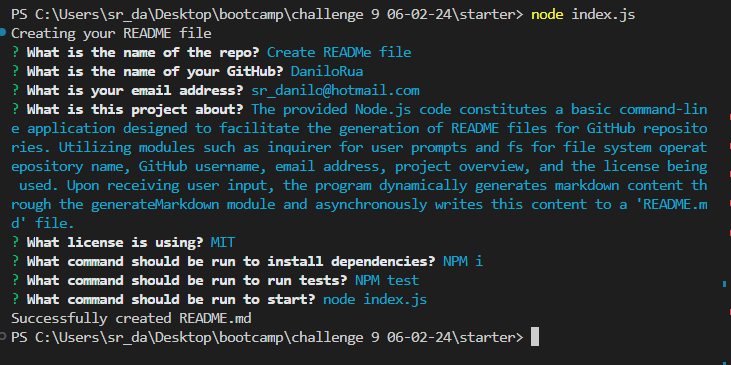

# create-README

  ## Overview
The provided Node.js code constitutes a basic command-line application designed to facilitate the generation of README files for GitHub repositories. Utilizing modules such as inquirer for user prompts and fs for file system operatepository name, GitHub username, email address, project overview, and the license being used. Upon receiving user input, the program dynamically generates markdown content through the generateMarkdown module and asynchronously writes this content to a 'README.md' file

## Table of Contents
1. [Installation](#Installation)
2. [Usage](#preview)
3. [License](#License)
4. [Tests](#Tests)
5. [Contact](#Contact)

## Installation

- Clone the repository
- Install using npm packages NPM i

## Usage

- After installation type a command line node index.js
- Answer the questions

- [Click here to watch how to use video](https://youtu.be/7ayFBna0gV8)
- 

## License
Licensed under the [MIT](https://github.com/DaniloRua/create-README/blob/master/LICENSE.txt) license.

## Tests

- Run test using command line NPM test

## Contact
- GitHub: [DaniloRua](https://github.com/DaniloRua)
- Email: <sr_danilo@hotmail.com>
